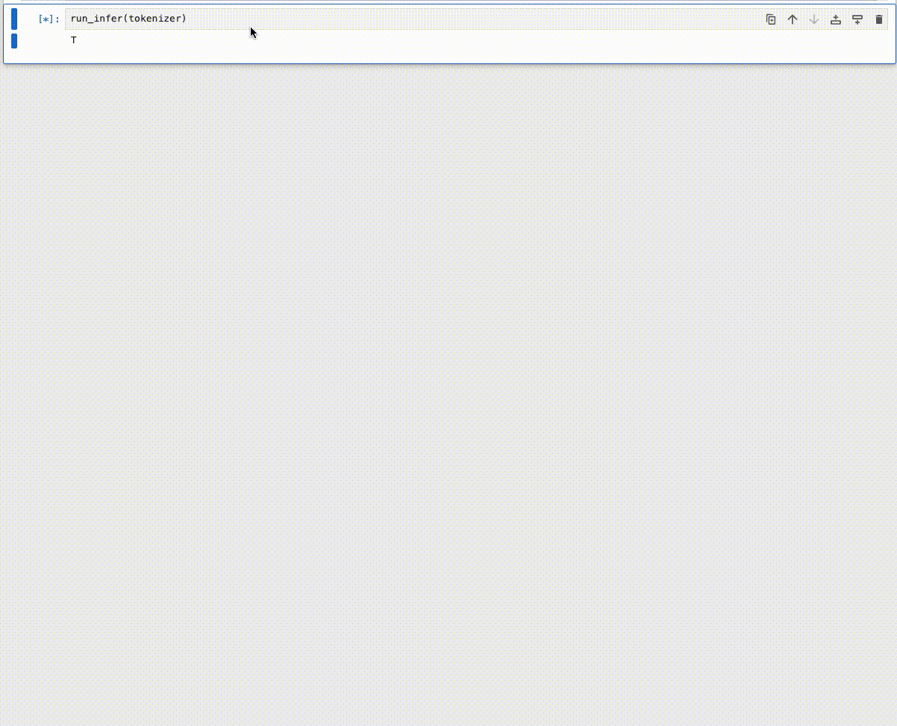

# This is tiny-shakespear 🍐

This is a toy project aimed at learning the transformer architecture, and the PyTorch framework.

The model has been trained on 40k lines of Shakespeare text, sourced from [karpathy/char-rnn](https://github.com/karpathy/char-rnn).

The model weights have been comitted to the repo, it was generated at git hash `87340f5e19b4ef06744477fa2a9ab2d25207c069`.

Here's a demo of the kind of text the model babbles.

---

### Installing the dependencies

`pip install -r requirements.txt`

Run the program using `python main.py`. Use command line arguments to specify which mode
you would like to use.

- data: generates the training, validation and test dataset from the raw text
- train: trains the model using the pre-generated dataset
- infer: runs autoregressive inference using the trained model
